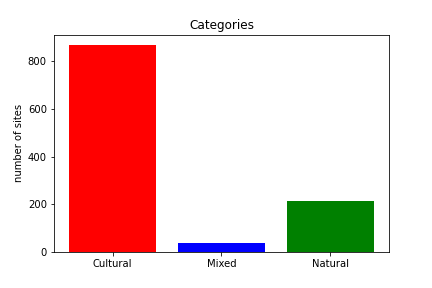
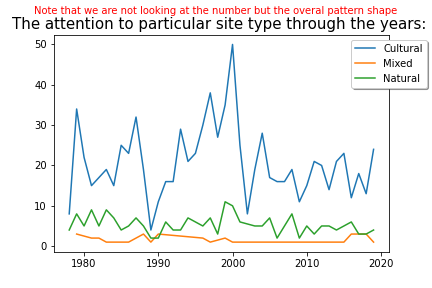
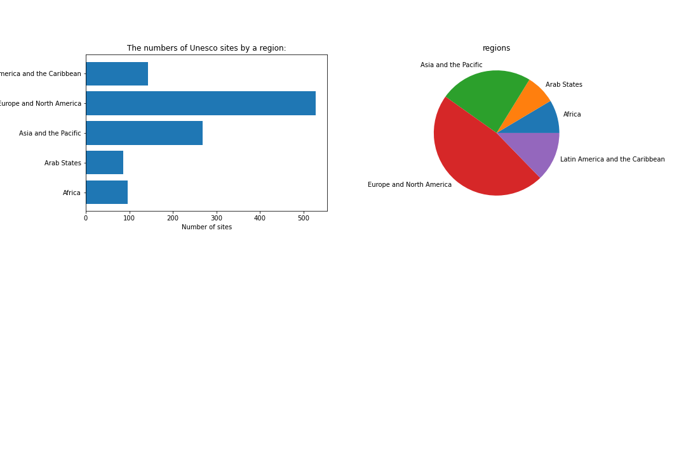
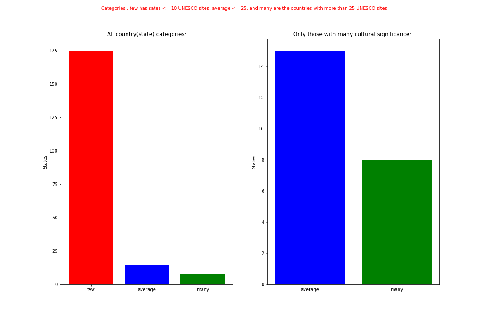
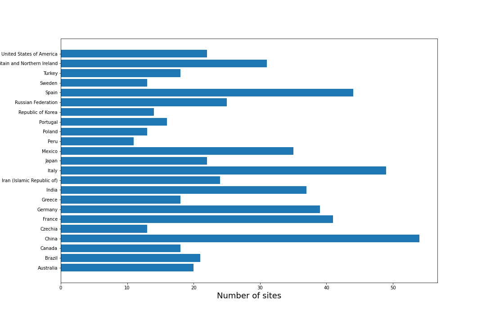
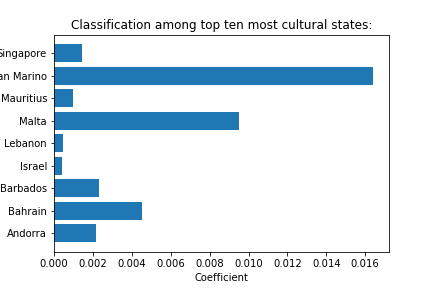

[(the code)](https://github.com/indzhov/Cultural-spread/blob/master/Untitled.ipynb)  

# The aims of the project : 
- To prove the hypothesis that the migration of the population has started from the middle east. 
- To visualize the pattern in the migration of the world by the time. 
- To calculate the coefficient of cultural significance per country .
- To Analyze the UNESCO sites and their different types. 
- To compare the different countries by their coefficient of cultural significance. 
- To see where my own country stands in the comparisson (e.g Bulgaria)
- To prove the hypothesis that Bulgaria is a crossroad between different cultures. 
- To prove that the Bulgaria stands like a wall between the Europe and the Middle East in this crossroad. 
- To analyze and try to find the answers behind some questions that may arise .

# Resources : 
- the UNESCO dataset [xml file](https://whc.unesco.org/en/list/xml/) 
- the Pantheon Project [Kaggle/csv file](https://www.kaggle.com/mit/pantheon-project)
- the Counntries of the World [Kaggle/csv file](https://www.kaggle.com/fernandol/countries-of-the-world)

# EDA 
# Categories of UNESCO sites
After the cleaning of the dataset. I have made some Explanatory Data Analysis. The result is some graphs. Which will be explained here. : 
The categorization among the UNESCO sites. :
 

# The Pattern in their inscription dates
The pattern in the attention to particular category of sites or overall. 
The interesting thing here is the peak that could been spot. It is the highiest one and it countiniously grow to the begining of the 21 Century, where is its highest point. After some research. the explanation is evident : 

"The explanation about the peak for the beginning of 21 century: Shortly after the publication of the 1987 Bruntland Report,which established that development was supported by three pillars -economy, society and environment -the linkages between culture and development was further demonstrated by the United Nations launch of the World Decade for Cultural Development (1988-1997), whose defining Page 2achievement was the report titled Our Creative Diversity,produced for UNESCO by an independent Commission chaired by J. Pérez de Cuellar in 1995. However itwas not untilthe Stockholm Conference on Cultural Policies for Development in 1998 and the Johannesburg World Summit onSustainable Development held in 2002 that culture was acknowledged as the fourth pillar of sustainable development alongside economic, social and environmental factors." To the original document : [(link)](https://unesdoc.unesco.org/ark:/48223/pf0000225460)  

# The sites location by regions
From the following graph is pretty evident, why the Europe is called the Old Conutry. It is the home for the majority of the UNESCO sites on the Earth with North America. 

# Country categories
There are countries with almost 50 UNESCO sites on among their borders and also, some with only one or without any, as well. 

# The Countries with most sites
On this graph we see the numbers of sites as the name of the conutry they are in. However, we can not compare every country as a equal. At least, for the reason that every contry has its own area. This, means it is unappropriate to compare China with San Marco, I am not shure even if San Marco has free space to keep the Great Chinese Wall. For that reason we are going to calulate a coefficient, which will serve us as a more appropriate observation, comparisson and classification. The coefficient is a result from the division of the number of places by the area of the country. 

# Most cultural states 
After the calculation and comparison the result is different. This time more appropriate in respect for every coultry, its capacity and area. 

# Bulgaria. 
Of course I want to see which are the location in my own country and where it stands in the overall classification. 
The result is Bulgaria has 8 UNESCO sites and it shares the place 32 . Also in [(the code)](https://github.com/indzhov/Cultural-spread/blob/master/Untitled.ipynb) there is a function with a for loop, which finds and downloads the images from the bulgarian location . they are as follow. 

# Boyana Church : 
# Madara Rider : 
# Thracian Tomb of Kazanlak : 
# Rock-Hewn Churches of Ivanovo : 
# Rila Monastery: 
# Ancient City of Nessebar: 
# Thracian Tomb of Sveshtari: 
# Srebarna Nature Reserve: 
# Pirin National Park: 

